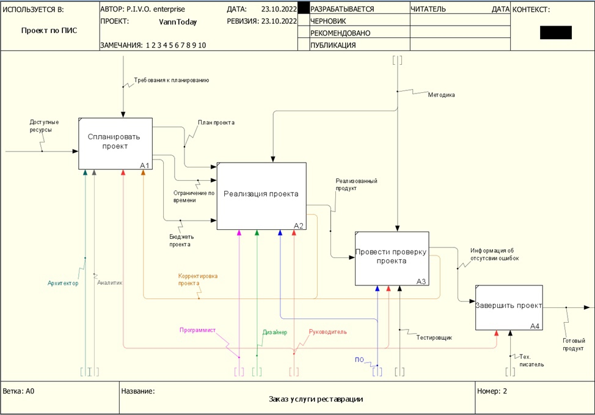
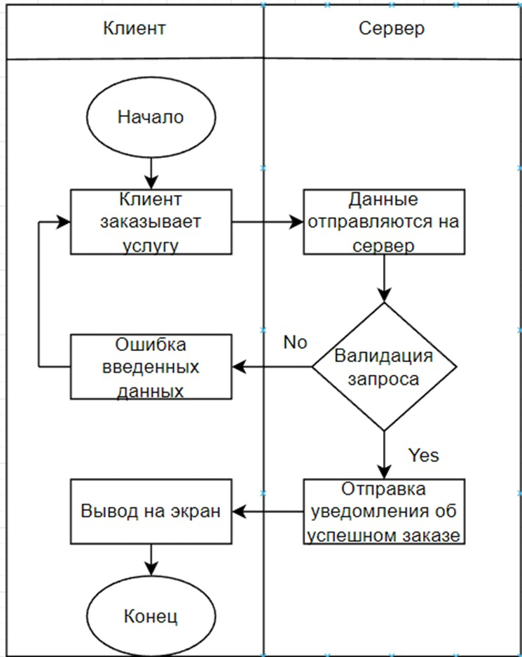

# BusinessGame

1.1 Рассматриваемая система (процесс)

1.1.1 Наименование: Процесс записи на услугу по реставрации ванн

1.1.2 Цель (назначение): Упрощение и автоматизация процесса записи

1.1.3 Разбор цели системы по SMART

<table role="table">
<thead>
<tr>
<th>Критерий</th>
<th align="center">Значение</th>
<th align="right">Оценка</th>
</tr>
</thead>
<tbody>
<tr>
<td>S (конкретность)</td>
<td align="center">Запись на реставрацию</td>
<td align="right">+ или -</td>
</tr>
<tr>
<td>М (измеримость)</td>
<td align="center">Количество записей</td>
<td align="right">+ или -</td>
</tr>
<tr>
<td>А (достижимость)</td>
<td align="center">Команда проекта, средства разработки</td>
<td align="right">+ или -</td>
</tr>
<tr>
<td>R (уместность)</td>
<td align="center">Инструментальное ПО</td>
<td align="right">+ или -</td>
</tr>
<tr>
<td>Т (ограниченность во времени)</td>
<td align="center">До конца 2 модуля</td>
<td align="right">+ или -</td>
</tr>
</tbody>
</table>

1.2 Предлагаемый проект

1.2.1 Наименование: Разработка веб-сайта с возможностью онлайн заказа услуги реставрации ванн.

1.2.2 Цель (изменяемый критерий SMART цели системы): Увеличение количества записей на услугу, автоматизация процесса.

1.2.3 Разбор цели проекта по SMART

<table role="table">
<thead>
<tr>
<th>Критерий</th>
<th align="center">Значение</th>
<th align="right">Оценка</th>
</tr>
</thead>
<tbody>
<tr>
<td>S (конкретность)</td>
<td align="center">Сформированные записи услуг в БД</td>
<td align="right">+ или -</td>
</tr>
<tr>
<td>М (измеримость)</td>
<td align="center">Корректность структуры записей услуг в БД</td>
<td align="right">+ или -</td>
</tr>
<tr>
<td>А (достижимость)</td>
<td align="center">Команда проекта/P.I.V.O</td>
<td align="right">+ или -</td>
</tr>
<tr>
<td>R (уместность)</td>
<td align="center">Ограничение: 10 часов на каждого участника команды</td>
<td align="right">+ или -</td>
</tr>
<tr>
<td>Т (ограниченность во времени)</td>
<td align="center">До конца 2 модуля</td>
<td align="right">+ или -</td>
</tr>
</tbody>
</table>

<strong>Канбан-доска (лр 2):</strong>
<a href="https://hilya113377.kaiten.ru/space/92493" rel="nofollow">https://hilya113377.kaiten.ru/space/92493</a>

<strong>1.2.4 Оценка трудозатрат</strong>

<table role="table">
<thead>
<tr>
<th>Критерий</th>
<th align="center">Значение</th>
<th align="right">Плановая</th>
<th>Фактическая</th>
</tr>
</thead>
<tbody>
<tr>
<td>РП (Владелец продукта)</td>
<td align="center">Регистрирует участников проекта</td>
<td align="right">25 мин</td>
<td>15 мин</td>
</tr>
<tr>
<td>РП (Владелец продукта)</td>
<td align="center">Принимает решение по всем возникающим проблемам</td>
<td align="right">45 мин</td>
<td>30 мин</td>
</tr>
<tr>
<td>РП (Владелец продукта)</td>
<td align="center">Принимает решение об успешности спринта, дает общую оценку работы команды и дает предложения по всем индивидуальным оценкам</td>
<td align="right">30 мин</td>
<td>30 мин</td>
</tr>
<tr>
<td>АД (Мастер)</td>
<td align="center">Получает оценку времени для каждой подзадачи, собирает sprint log, назначает исполнителей</td>
<td align="right">25 мин</td>
<td>15 мин</td>
</tr>
<tr>
<td>АД (Мастер)</td>
<td align="center">Проводит stand-up совещание</td>
<td align="right">90 мин * 5 (5 собраний)</td>
<td>120 мин * 5</td>
</tr>
<tr>
<td>АД (Мастер)</td>
<td align="center">Проводит демонстрацию результатов спринта владельцу продукта и другим заинтересованным лицам</td>
<td align="right">30 мин</td>
<td>35 мин</td>
</tr>
<tr>
<td>СП (Аналитик)</td>
<td align="center">Регистрирует возникающие дополнительные задачи (issue) в соответствующих проектах</td>
<td align="right">15 мин * 2</td>
<td>15 мин *2</td>
</tr>
<tr>
<td>СП (Аналитик)</td>
<td align="center">Выполняет все разработанные тесты, регистрирует все выявленные несоответствия требованиям</td>
<td align="right">60 мин</td>
<td>60 мин</td>
</tr>
<tr>
<td>ВН (Дизайнер)</td>
<td align="center">Переработка существующего интерфейса программы в соответствии с новым макетом</td>
<td align="right">15 мин</td>
<td>20 мин</td>
</tr>
<tr>
<td>ВН (Дизайнер)</td>
<td align="center">Создание финального дизайн-макета на основе проведенных тестов и переговоров с компанией</td>
<td align="right">30 мин</td>
<td>30 мин</td>
</tr>
<tr>
<td>БА (Тестировщик)</td>
<td align="center">Разрабатывает процедуры - тесты и тестовые наборы данных</td>
<td align="right">110 мин</td>
<td>110 мин</td>
</tr>
<tr>
<td>БА (Тестировщик)</td>
<td align="center">Тестирует внедренное ПО в среде</td>
<td align="right">30 мин</td>
<td>30 мин</td>
</tr>
<tr>
<td>НИ (Архитектор)</td>
<td align="center">Определяет дополнительные требования к выполнению задач</td>
<td align="right">60 мин</td>
<td>60 мин</td>
</tr>
<tr>
<td>НИ (Архитектор)</td>
<td align="center">Решает возникающие несоответствия при наладке системы на физическом уровне</td>
<td align="right">40 мин</td>
<td>40 мин</td>
</tr>
<tr>
<td>НИ (Архитектор)</td>
<td align="center">Принимает решение по всем выявленных несоответствиям требованиям</td>
<td align="right">20 мин</td>
<td>15 мин</td>
</tr>
<tr>
<td>ПП (Программист)</td>
<td align="center">Интегрирует с помощью кода готовое ПО в среду сайта, по необходимости дописывает процедуры и функции для успешного внедрения ПО в систему</td>
<td align="right">100 мин</td>
<td>100 мин</td>
</tr>
<tr>
<td>ПП (Программист)</td>
<td align="center">Выполняет корректирующие действия по ПО на основе тестов</td>
<td align="right">90 мин</td>
<td>90 мин</td>
</tr>
<tr>
<td>ПП (Программист)</td>
<td align="center">Разрабатывает алгоритмы выполнения всех подзадач, требующих программной реализации</td>
<td align="right">60 мин</td>
<td>60 мин</td>
</tr>
<tr>
<td>КО (Тех.писатель)</td>
<td align="center">Делает описания для всех подзадач, требующих корректировки</td>
<td align="right">20 мин</td>
<td>20 мин</td>
</tr>
<tr>
<td>КО (Тех.писатель)</td>
<td align="center">Корректирует или делает новые описания для всех разработанных процедур</td>
<td align="right">20 мин</td>
<td>20 мин</td>
</tr>
<tr>
<td>КО (Тех.писатель)</td>
<td align="center">Разрабатывает требуемые описания всех разработанных процедур, тестов и тестовых наборов данных, разрабатывает документацию (руководство пользователя)</td>
<td align="right">50 мин</td>
<td>50 мин</td>
</tr>
</tbody>
</table>

<strong>1.2.5 Основной поток</strong>

<table role="table">
<thead>
<tr>
<th>Участник</th>
<th align="center">Действие (activity)</th>
<th>Ожидаемый результат</th>
</tr>
</thead>
<tbody>
<tr>
<td>АД (Мастер)</td>
<td align="center">Проводит stand-up совещание</td>
<td>Статус задач отмечен на канбан-доске, проблемы зарегистрированы и назначены РП в форме дополнительных задач (issue)</td>
</tr>
<tr>
<td>ВН (Дизайнер)</td>
<td align="center">Разрабатывает удобный для аудитории интерфейс</td>
<td>интерфейс приложения, приспособленный под среду предприятия</td>
</tr>
<tr>
<td>СП (Аналитик)</td>
<td align="center">Регистрирует возникающие дополнительные задачи (issue) в соответствующих проектах</td>
<td>Задачи с номером</td>
</tr>
<tr>
<td>НИ (Архитектор)</td>
<td align="center">Определяет дополнительные требования к выполнению задач</td>
<td>Среда гипермаркета для внедрения ПО изучена</td>
</tr>
<tr>
<td>КО (Тех.писатель)</td>
<td align="center">Регистрирует комментарии Архитектора о среде внедрения</td>
<td>Описание и необходимые диаграммы в комментариях к задаче</td>
</tr>
<tr>
<td>РП (Владелец продукта)</td>
<td align="center">Принимает решение по всем возникающим проблемам</td>
<td>Комментарии к проблемам (issue)</td>
</tr>
</tbody>
</table>

<strong>1.2.6</strong>

<table role="table">
<thead>
<tr>
<th>Условие (риск)</th>
<th align="center">Последствия</th>
<th align="right">Реакция</th>
</tr>
</thead>
<tbody>
<tr>
<td>Созданные задачи не полностью покрывают задачи проекта</td>
<td align="center">Срыв сроков выполнения</td>
<td align="right">Распределить новые задачи участникам команды и ввести санкции</td>
</tr>
</tbody>
</table>

<strong>1.2.7</strong> Проектные риски (спринт)

<ul>
<li><del>1. Дефицит специалистов</del></li>
<li><strong>2. Нереалистичные сроки и бюджет</strong></li>
<li><del>3. Реализация несоответствующей функциональности</del></li>
<li><del>4. Разработка неправильного пользовательского интерфейса</del></li>
<li><strong>5. «Золотая сервировка», перфекционизм, ненужная оптимизация и оттачивание деталей</strong></li>
<li><strong>6. Непрекращающийся поток изменений</strong></li>
<li><del>7. Нехватка информации о внешних компонентах, определяющих окружение системы или вовлечённых в интеграцию</del></li>
<li><del>8. Недостатки в работах, выполняемых внешними (по отношению к проекту) ресурсами</del></li>
<li><strong>9. Недостаточная производительность получаемой системы</strong></li>
<li><strong>10. Разрыв между квалификацией специалистов и требованиями проекта</strong></li>
</ul>
<table role="table">
<thead>
<tr>
<th>Условие (риск)</th>
<th align="center">Последствия</th>
<th align="right">Реакция</th>
</tr>
</thead>
<tbody>
<tr>
<td>Созданные задачи не полностью покрывают задачи проекта</td>
<td align="center">Срыв сроков выполнения</td>
<td align="right">Распределить новые задачи участникам команды и ввести санкции</td>
</tr>
</tbody>
</table>
<table role="table">
<thead>
<tr>
<th>Вид риска</th>
<th>Название риска (описание события)</th>
<th>Вероятность</th>
<th>Стратегия</th>
<th>Мероприятие</th>
</tr>
</thead>
<tbody>
<tr>
<td>2</td>
<td>Нереалистичные сроки и бюджет</td>
<td><g-emoji class="g-emoji" alias="yellow_circle" fallback-src="https://github.githubassets.com/images/icons/emoji/unicode/1f7e1.png">🟡</g-emoji></td>
<td>Снижение (Mitigation)</td>
<td>Остановиться на создании прототипа со всеми минимально необходимыми функциями</td>
</tr>
<tr>
<td>5</td>
<td>«Золотая сервировка», перфекционизм, ненужная оптимизация и оттачивание деталей</td>
<td><g-emoji class="g-emoji" alias="yellow_circle" fallback-src="https://github.githubassets.com/images/icons/emoji/unicode/1f7e1.png">🟡</g-emoji></td>
<td>Снижение (Mitigation)</td>
<td>Поддерживать тесный контакт с владельцами стоматологии</td>
</tr>
<tr>
<td>6</td>
<td>Непрекращающийся поток изменений</td>
<td><g-emoji class="g-emoji" alias="yellow_circle" fallback-src="https://github.githubassets.com/images/icons/emoji/unicode/1f7e1.png">🟡</g-emoji></td>
<td>Снижение (Mitigation)</td>
<td>Поддерживать тесный контакт с владельцами стоматологии</td>
</tr>
<tr>
<td>9</td>
<td>Недостаточная производительность получаемой системы</td>
<td><g-emoji class="g-emoji" alias="yellow_circle" fallback-src="https://github.githubassets.com/images/icons/emoji/unicode/1f7e1.png">🟡</g-emoji></td>
<td>Снижение (Mitigation)</td>
<td>Поддерживать тесный контакт с владельцами стоматологии</td>
</tr>
<tr>
<td>10</td>
<td>Разрыв между квалификацией специалистов и требованиями проекта</td>
<td><g-emoji class="g-emoji" alias="yellow_circle" fallback-src="https://github.githubassets.com/images/icons/emoji/unicode/1f7e1.png">🟡</g-emoji></td>
<td>Снижение (Mitigation)</td>
<td>Поддерживать тесный контакт с владельцами стоматологии</td>
</tr>
</tbody>
</table>

<strong>1.2.8</strong>

<table role="table">
<thead>
<tr>
<th>Основная роль</th>
<th align="center">Ответственность (компетенция, зона принятия решений)</th>
<th>Ожидаемый результат</th>
</tr>
</thead>
<tbody>
<tr>
<td>РП (Владелец продукта)</td>
<td align="center">Бизнес-результат, решение проблем, обеспечение ресурсами</td>
<td>Статус задач отмечен на канбан-доске, проблемы зарегистрированы и назначены РП в форме дополнительных задач (issue)</td>
</tr>
<tr>
<td>АД (Мастер)</td>
<td align="center">Диспетчирование и контроль задач, выявление проблем</td>
<td>Интерфейс приложения, приспособленный под среду предприятия</td>
</tr>
<tr>
<td>СП (Аналитик)</td>
<td align="center">Сбор и управление всеми требованиями в проекте</td>
<td>Задачи с номером</td>
</tr>
<tr>
<td>ВН (Дизайнер)</td>
<td align="center">Удобство использования, привлекательность продукта</td>
<td>Среда гипермаркета для внедрения ПО изучена</td>
</tr>
<tr>
<td>БА (Тестировщик)</td>
<td align="center">Выявление бизнес-проблем, способы тестирования</td>
<td>Описание и необходимые диаграммы в комментариях к задаче</td>
</tr>
<tr>
<td>НИ (Архитектор)</td>
<td align="center">Структура продукта, инструменты разработки и поставки</td>
<td>Комментарии к проблемам (issue)</td>
</tr>
<tr>
<td>ПП (Программист)</td>
<td align="center">Стиль и способы разработки, используемые фреймворки</td>
<td>Комментарии к проблемам (issue)</td>
</tr>
<tr>
<td>КО (Тех.писатель)</td>
<td align="center">Документирование проекта и продукта</td>
<td>Комментарии к проблемам (issue)</td>
</tr>
</tbody>
</table>

<strong>Канбан-доска по результатам выполнения ЛР1</strong>

<h1><a id="user-content-2-выполнение-лр2" class="anchor" aria-hidden="true" href="#2-выполнение-лр2"><svg class="octicon octicon-link" viewBox="0 0 16 16" version="1.1" width="16" height="16" aria-hidden="true"><path fill-rule="evenodd" d="M7.775 3.275a.75.75 0 001.06 1.06l1.25-1.25a2 2 0 112.83 2.83l-2.5 2.5a2 2 0 01-2.83 0 .75.75 0 00-1.06 1.06 3.5 3.5 0 004.95 0l2.5-2.5a3.5 3.5 0 00-4.95-4.95l-1.25 1.25zm-4.69 9.64a2 2 0 010-2.83l2.5-2.5a2 2 0 012.83 0 .75.75 0 001.06-1.06 3.5 3.5 0 00-4.95 0l-2.5 2.5a3.5 3.5 0 004.95 4.95l1.25-1.25a.75.75 0 00-1.06-1.06l-1.25 1.25a2 2 0 01-2.83 0z"></path></svg></a>2. Выполнение ЛР2</h1>

<strong>Создание тестов для валидация даты при бронировании консультации.</strong>

Тест не выдающий ошибку при выборе даты консультации, соответствующей валидной дате (рабочее время клиники, можно выбирать только дату, которая ещё не наступила).

Тест выдающий ошибку при попытке ввести дату, когда заведение закрыто. Невозможность выбрать невалидную дату.

<strong>Создание тестов для получения доступа к сайту</strong>

Тест, не позволяющий открыть сайт при отсутствии интернета на устройстве

Тест, позволяющий открыть сайт при наличии интернета на устройстве

<strong>Создание тестов для корректного отображения вёрстки</strong>

Тест верного отображения html страницы в различных браузерах производится в следующих браузерах:

<ul>
<li><a href="https://www.opera.com/ru" rel="nofollow">Opera</a></li>
<li><a href="https://www.google.com/chrome/" rel="nofollow">Chrome</a></li>
<li><a href="https://www.microsoft.com/ru-ru/download/internet-explorer.aspx" rel="nofollow">Internet explorer</a></li>
</ul>

Тест верного отображения html страницы с различных устройств и операционных систем:
Мобильные устройства:

<ul>
<li>Android</li>
<li>Iphone</li>
</ul>

Персональный компьютер:

<ul>
<li>Windows</li>
</ul>

Функциональное тестирование приложения
Проверка что корректно работает весь функционал приложения "от и до" тест-кейс:

Открыть страницу в браузере. Посмотреть что все отображается корректно
Перейти на страницу записи на услугу
Попробовать ввести корректную дату
Получить сообщение о том, что запись прошла успешно

<h1><a id="user-content-21-проектирование-веб-сайта" class="anchor" aria-hidden="true" href="#21-проектирование-веб-сайта"><svg class="octicon octicon-link" viewBox="0 0 16 16" version="1.1" width="16" height="16" aria-hidden="true"><path fill-rule="evenodd" d="M7.775 3.275a.75.75 0 001.06 1.06l1.25-1.25a2 2 0 112.83 2.83l-2.5 2.5a2 2 0 01-2.83 0 .75.75 0 00-1.06 1.06 3.5 3.5 0 004.95 0l2.5-2.5a3.5 3.5 0 00-4.95-4.95l-1.25 1.25zm-4.69 9.64a2 2 0 010-2.83l2.5-2.5a2 2 0 012.83 0 .75.75 0 001.06-1.06 3.5 3.5 0 00-4.95 0l-2.5 2.5a3.5 3.5 0 004.95 4.95l1.25-1.25a.75.75 0 00-1.06-1.06l-1.25 1.25a2 2 0 01-2.83 0z"></path></svg></a>2.1. Проектирование веб-сайта</h1>

<strong>Создание диаграммы IDEF0</strong>

<strong>Создание диаграммы UML Activity</strong>

<h1><a id="user-content-22-внешний-вид-веб-сайта" class="anchor" aria-hidden="true" href="#22-внешний-вид-веб-сайта"><svg class="octicon octicon-link" viewBox="0 0 16 16" version="1.1" width="16" height="16" aria-hidden="true"><path fill-rule="evenodd" d="M7.775 3.275a.75.75 0 001.06 1.06l1.25-1.25a2 2 0 112.83 2.83l-2.5 2.5a2 2 0 01-2.83 0 .75.75 0 00-1.06 1.06 3.5 3.5 0 004.95 0l2.5-2.5a3.5 3.5 0 00-4.95-4.95l-1.25 1.25zm-4.69 9.64a2 2 0 010-2.83l2.5-2.5a2 2 0 012.83 0 .75.75 0 001.06-1.06 3.5 3.5 0 00-4.95 0l-2.5 2.5a3.5 3.5 0 004.95 4.95l1.25-1.25a.75.75 0 00-1.06-1.06l-1.25 1.25a2 2 0 01-2.83 0z"></path></svg></a>2.2. Внешний вид веб-сайта</h1>

<strong>Главная страница</strong>

<strong>Выбор сервиса</strong>

<strong>Выбор даты</strong>

<strong>Выбор времени</strong>

<strong>Запись на прием</strong>

<strong>Уведомление об успешной записи на прием</strong>

<h1><a id="user-content-23-диаграмма-деятельности" class="anchor" aria-hidden="true" href="#23-диаграмма-деятельности"><svg class="octicon octicon-link" viewBox="0 0 16 16" version="1.1" width="16" height="16" aria-hidden="true"><path fill-rule="evenodd" d="M7.775 3.275a.75.75 0 001.06 1.06l1.25-1.25a2 2 0 112.83 2.83l-2.5 2.5a2 2 0 01-2.83 0 .75.75 0 00-1.06 1.06 3.5 3.5 0 004.95 0l2.5-2.5a3.5 3.5 0 00-4.95-4.95l-1.25 1.25zm-4.69 9.64a2 2 0 010-2.83l2.5-2.5a2 2 0 012.83 0 .75.75 0 001.06-1.06 3.5 3.5 0 00-4.95 0l-2.5 2.5a3.5 3.5 0 004.95 4.95l1.25-1.25a.75.75 0 00-1.06-1.06l-1.25 1.25a2 2 0 01-2.83 0z"></path></svg></a>2.3. Диаграмма деятельности</h1>

<strong>2.3.1. Основной поток</strong>

<table role="table">
<thead>
<tr>
<th>Участник</th>
<th align="center">Действие (activity)</th>
<th>Ожидаемый результат</th>
</tr>
</thead>
<tbody>
<tr>
<td>АД (Мастер)</td>
<td align="center">Проводит stand-up совещание</td>
<td>Статус задач отмечен на канбан-доске, проблемы зарегистрированы и назначены РП в форме дополнительных задач (issue)</td>
</tr>
<tr>
<td>ВН (Дизайнер)</td>
<td align="center">Разрабатывает удобный для аудитории интерфейс</td>
<td>интерфейс приложения, приспособленный под среду предприятия</td>
</tr>
<tr>
<td>СП (Аналитик)</td>
<td align="center">Регистрирует возникающие дополнительные задачи (issue) в соответствующих проектах</td>
<td>Задачи с номером</td>
</tr>
<tr>
<td>НИ (Архитектор)</td>
<td align="center">Определяет дополнительные требования к выполнению задач</td>
<td>Среда гипермаркета для внедрения ПО изучена</td>
</tr>
<tr>
<td>КО (Тех.писатель)</td>
<td align="center">Регистрирует комментарии Архитектора о среде внедрения</td>
<td>Описание и необходимые диаграммы в комментариях к задаче</td>
</tr>
<tr>
<td>РП (Владелец продукта)</td>
<td align="center">Принимает решение по всем возникающим проблемам</td>
<td>Комментарии к проблемам (issue)</td>
</tr>
</tbody>
</table>

<strong>Описание возможностей:</strong>

Аннотация: 
Стоматология Lavanda представляет интерактивный портал для услуг записи на прием к врачу, просмотра актуальной информации о доступном времени для записи к определенному врачу,
информации о наших высококваллифицированных специалистах, а также прейскурант всех предоставляемых компанией услуг.

<ol>
<li>Описание функциональных возможностей сайта.</li>
</ol>
<blockquote>

Запись к врачу

</blockquote>
<ul>
<li>Создание записи приема пользователя сайта у определенным врача на выбранное время.</li>
</ul>
<blockquote>

Просмотр доступных услуг

</blockquote>
<ul>
<li>Просмотр страницы со списком предоставляемых клиникой услуг и прайс-листом.</li>
</ul>
<blockquote>

Просмотр врачей

</blockquote>
<ul>
<li>Просмотр страницы с информацией о врачах: их квалификации, стаже, спецализации, предоставляемых услугах, а также пользовательских отзывах на них.</li>
</ul>
<blockquote>

Просмотр календаря посещений

</blockquote>
<ul>
<li>Просмотр страницы с информацией о существующих приемах у врачей и свободном для приема времени.</li>
</ul>

1.1. Описание выполняемых функций сайта.

1.1.1. Описание функции «запись к врачу».
После прохождения регистрации на сайте станет возможно записаться к врачу. В процессе создания записи о приеме будет предложена возможность выбрать из списка доступных врачей
подходящего по специализации, просмотреть и выбрать свободное время для создания записи. После создания записи можно получить электронный талон на посещение, с необходимой информацией о сеансе.

1.1.2. Описание функции «Просмотр доступных услуг»
Выбранная функция представляет собой сводку актуальной информации по предоставляемым клиникой услугам, а также заявленым ценам на данные услуги.

1.1.3. Описание функции «Просмотр врачей»
Выбранная функция представляет для просмотра список врачей, а также необходимую информацию об их личных и профессиональных данных.

1.1.4. Описание функции «Просмотр календаря посещений»
Выбранная функция представляет визуальное отображение доступных интервалов времени для записи к определенному врачу в рамках рабочего времени клиники.

    

  

  

  </turbo-frame>
  

  

