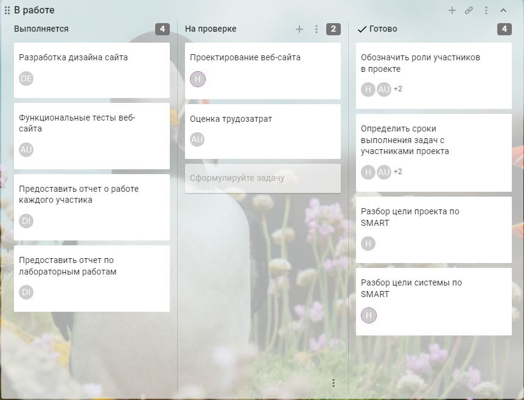
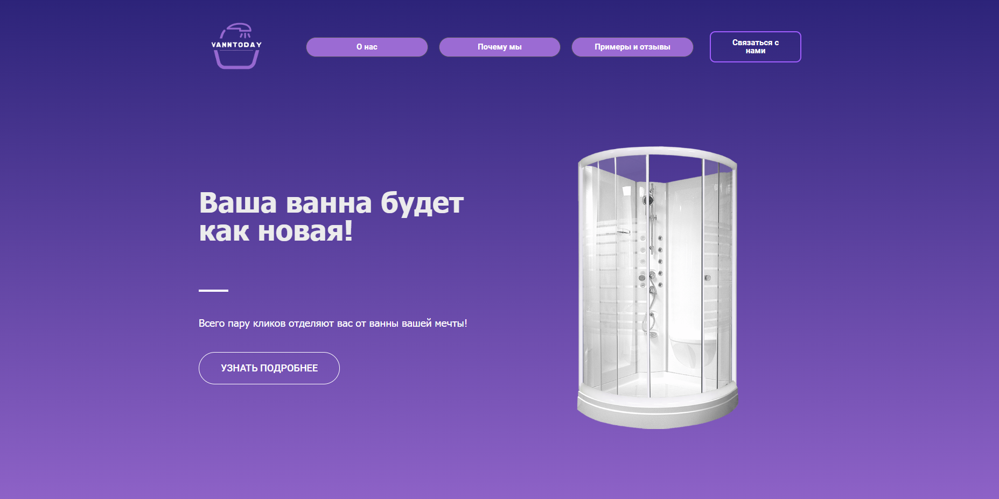
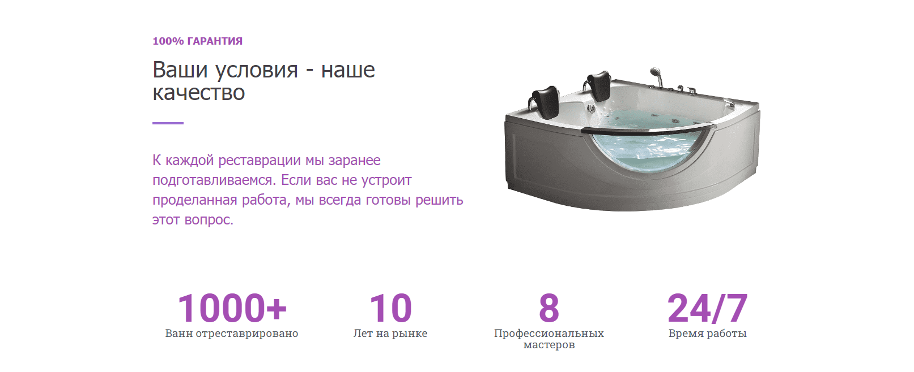
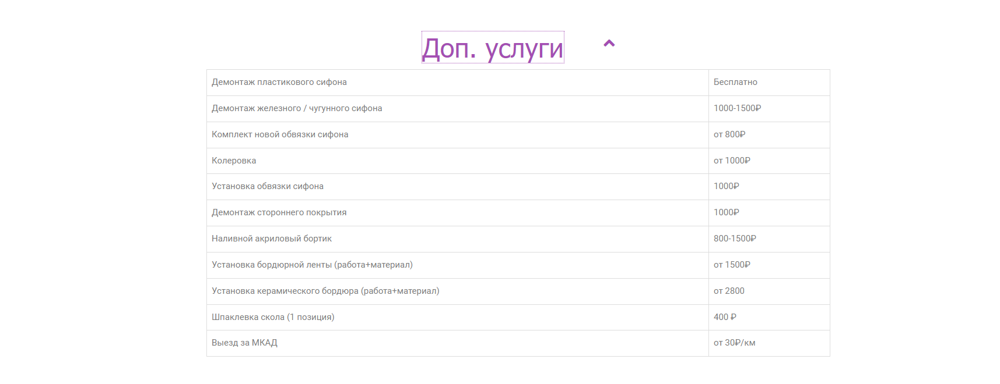
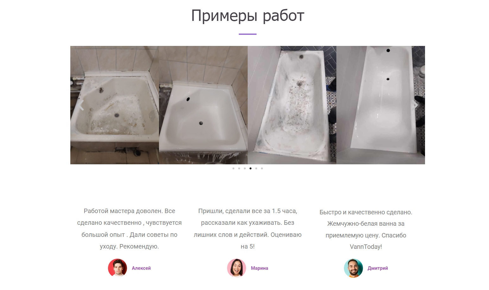
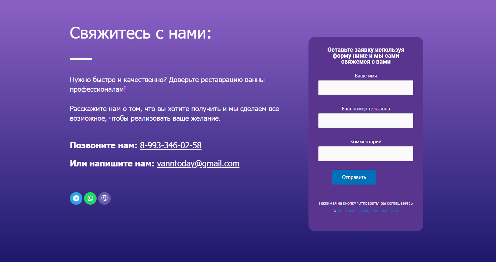
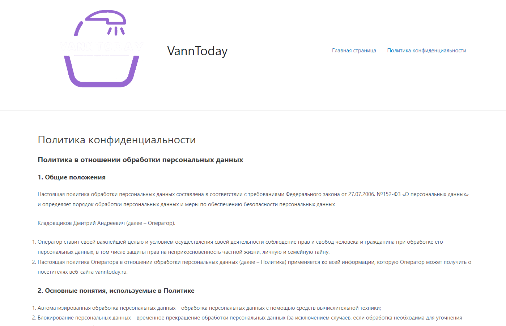
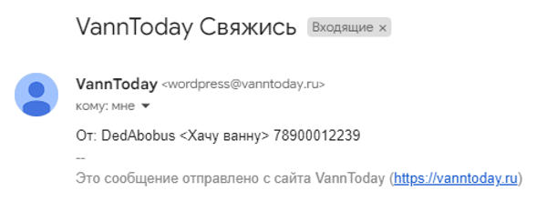
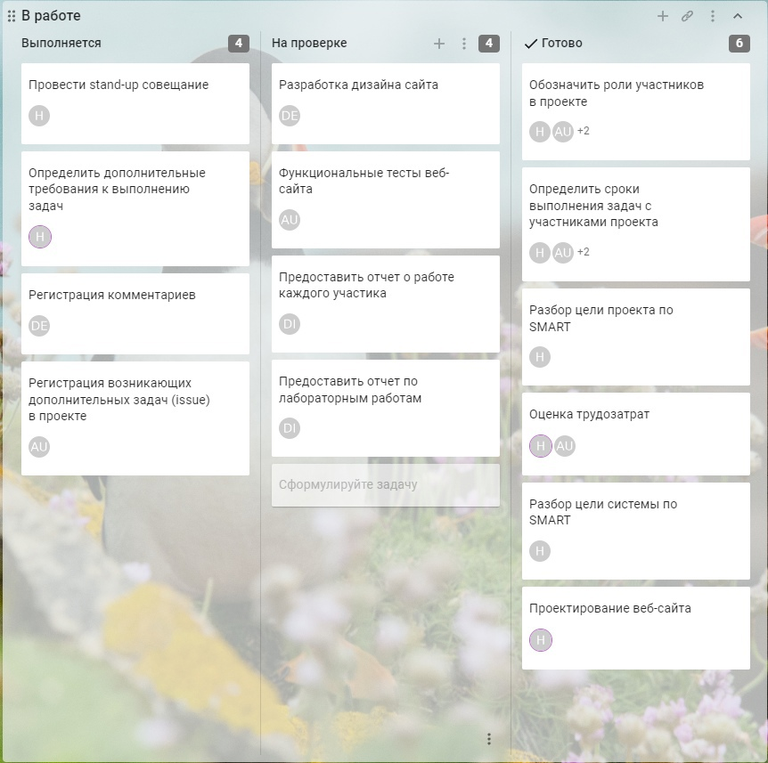
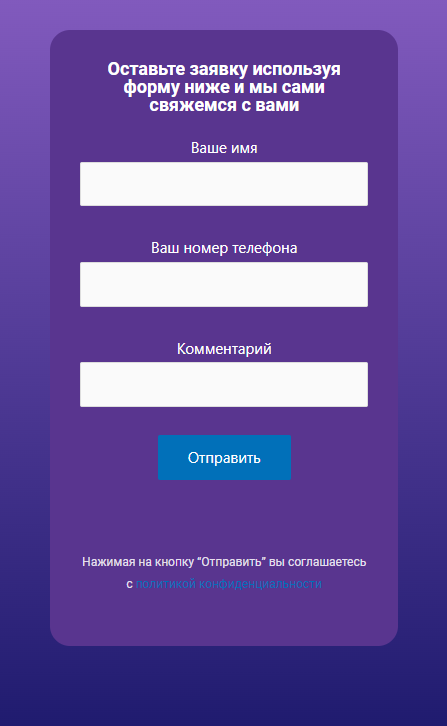

# BusinessGame

1.1 Рассматриваемая система (процесс)

1.1.1 Наименование: Процесс записи на услугу по реставрации ванн

1.1.2 Цель (назначение): Упрощение и автоматизация процесса записи

1.1.3 Разбор цели системы по SMART

<table role="table">
<thead>
<tr>
<th>Критерий</th>
<th align="center">Значение</th>
<th align="right">Оценка</th>
</tr>
</thead>
<tbody>
<tr>
<td>S (конкретность)</td>
<td align="center">Запись на реставрацию</td>
<td align="right">+ или -</td>
</tr>
<tr>
<td>М (измеримость)</td>
<td align="center">Количество записей</td>
<td align="right">+ или -</td>
</tr>
<tr>
<td>А (достижимость)</td>
<td align="center">Команда проекта, средства разработки</td>
<td align="right">+ или -</td>
</tr>
<tr>
<td>R (уместность)</td>
<td align="center">Инструментальное ПО</td>
<td align="right">+ или -</td>
</tr>
<tr>
<td>Т (ограниченность во времени)</td>
<td align="center">До конца 2 модуля</td>
<td align="right">+ или -</td>
</tr>
</tbody>
</table>

1.2 Предлагаемый проект

1.2.1 Наименование: Разработка веб-сайта с возможностью онлайн заказа услуги реставрации ванн.

1.2.2 Цель (изменяемый критерий SMART цели системы): Увеличение количества записей на услугу, автоматизация процесса.

1.2.3 Разбор цели проекта по SMART

<table role="table">
<thead>
<tr>
<th>Критерий</th>
<th align="center">Значение</th>
<th align="right">Оценка</th>
</tr>
</thead>
<tbody>
<tr>
<td>S (конкретность)</td>
<td align="center">Сформированные записи услуг в БД</td>
<td align="right">+ или -</td>
</tr>
<tr>
<td>М (измеримость)</td>
<td align="center">Корректность структуры записей услуг в БД</td>
<td align="right">+ или -</td>
</tr>
<tr>
<td>А (достижимость)</td>
<td align="center">Команда проекта/P.I.V.O</td>
<td align="right">+ или -</td>
</tr>
<tr>
<td>R (уместность)</td>
<td align="center">Ограничение: 10 часов на каждого участника команды</td>
<td align="right">+ или -</td>
</tr>
<tr>
<td>Т (ограниченность во времени)</td>
<td align="center">До конца 2 модуля</td>
<td align="right">+ или -</td>
</tr>
</tbody>
</table>

<strong>Канбан-доска (лр 2):</strong>
<a href="https://hilya113377.kaiten.ru/space/92493" rel="nofollow">https://hilya113377.kaiten.ru/space/92493</a>

<strong>1.2.4 Оценка трудозатрат</strong>

<table role="table">
<thead>
<tr>
<th>Критерий</th>
<th align="center">Значение</th>
<th align="right">Плановая</th>
<th>Фактическая</th>
</tr>
</thead>
<tbody>
<tr>
<td>РП (Владелец продукта)</td>
<td align="center">Регистрирует участников проекта</td>
<td align="right">25 мин</td>
<td>15 мин</td>
</tr>
<tr>
<td>РП (Владелец продукта)</td>
<td align="center">Принимает решение по всем возникающим проблемам</td>
<td align="right">45 мин</td>
<td>30 мин</td>
</tr>
<tr>
<td>РП (Владелец продукта)</td>
<td align="center">Принимает решение об успешности спринта, дает общую оценку работы команды и дает предложения по всем индивидуальным оценкам</td>
<td align="right">30 мин</td>
<td>30 мин</td>
</tr>
<tr>
<td>АД (Мастер)</td>
<td align="center">Получает оценку времени для каждой подзадачи, собирает sprint log, назначает исполнителей</td>
<td align="right">25 мин</td>
<td>15 мин</td>
</tr>
<tr>
<td>АД (Мастер)</td>
<td align="center">Проводит stand-up совещание</td>
<td align="right">90 мин * 5 (5 собраний)</td>
<td>120 мин * 5</td>
</tr>
<tr>
<td>АД (Мастер)</td>
<td align="center">Проводит демонстрацию результатов спринта владельцу продукта и другим заинтересованным лицам</td>
<td align="right">30 мин</td>
<td>35 мин</td>
</tr>
<tr>
<td>СП (Аналитик)</td>
<td align="center">Регистрирует возникающие дополнительные задачи (issue) в соответствующих проектах</td>
<td align="right">15 мин * 2</td>
<td>15 мин *2</td>
</tr>
<tr>
<td>СП (Аналитик)</td>
<td align="center">Выполняет все разработанные тесты, регистрирует все выявленные несоответствия требованиям</td>
<td align="right">60 мин</td>
<td>60 мин</td>
</tr>
<tr>
<td>ВН (Дизайнер)</td>
<td align="center">Переработка существующего интерфейса программы в соответствии с новым макетом</td>
<td align="right">15 мин</td>
<td>20 мин</td>
</tr>
<tr>
<td>ВН (Дизайнер)</td>
<td align="center">Создание финального дизайн-макета на основе проведенных тестов и переговоров с компанией</td>
<td align="right">30 мин</td>
<td>30 мин</td>
</tr>
<tr>
<td>БА (Тестировщик)</td>
<td align="center">Разрабатывает процедуры - тесты и тестовые наборы данных</td>
<td align="right">110 мин</td>
<td>110 мин</td>
</tr>
<tr>
<td>БА (Тестировщик)</td>
<td align="center">Тестирует внедренное ПО в среде</td>
<td align="right">30 мин</td>
<td>30 мин</td>
</tr>
<tr>
<td>НИ (Архитектор)</td>
<td align="center">Определяет дополнительные требования к выполнению задач</td>
<td align="right">60 мин</td>
<td>60 мин</td>
</tr>
<tr>
<td>НИ (Архитектор)</td>
<td align="center">Решает возникающие несоответствия при наладке системы на физическом уровне</td>
<td align="right">40 мин</td>
<td>40 мин</td>
</tr>
<tr>
<td>НИ (Архитектор)</td>
<td align="center">Принимает решение по всем выявленных несоответствиям требованиям</td>
<td align="right">20 мин</td>
<td>15 мин</td>
</tr>
<tr>
<td>ПП (Программист)</td>
<td align="center">Интегрирует с помощью кода готовое ПО в среду сайта, по необходимости дописывает процедуры и функции для успешного внедрения ПО в систему</td>
<td align="right">100 мин</td>
<td>100 мин</td>
</tr>
<tr>
<td>ПП (Программист)</td>
<td align="center">Выполняет корректирующие действия по ПО на основе тестов</td>
<td align="right">90 мин</td>
<td>90 мин</td>
</tr>
<tr>
<td>ПП (Программист)</td>
<td align="center">Разрабатывает алгоритмы выполнения всех подзадач, требующих программной реализации</td>
<td align="right">60 мин</td>
<td>60 мин</td>
</tr>
<tr>
<td>КО (Тех.писатель)</td>
<td align="center">Делает описания для всех подзадач, требующих корректировки</td>
<td align="right">20 мин</td>
<td>20 мин</td>
</tr>
<tr>
<td>КО (Тех.писатель)</td>
<td align="center">Корректирует или делает новые описания для всех разработанных процедур</td>
<td align="right">20 мин</td>
<td>20 мин</td>
</tr>
<tr>
<td>КО (Тех.писатель)</td>
<td align="center">Разрабатывает требуемые описания всех разработанных процедур, тестов и тестовых наборов данных, разрабатывает документацию (руководство пользователя)</td>
<td align="right">50 мин</td>
<td>50 мин</td>
</tr>
</tbody>
</table>

<strong>1.2.5 Основной поток</strong>

<table role="table">
<thead>
<tr>
<th>Участник</th>
<th align="center">Действие (activity)</th>
<th>Ожидаемый результат</th>
</tr>
</thead>
<tbody>
<tr>
<td>АД (Мастер)</td>
<td align="center">Проводит stand-up совещание</td>
<td>Статус задач отмечен на канбан-доске, проблемы зарегистрированы и назначены РП в форме дополнительных задач (issue)</td>
</tr>
<tr>
<td>ВН (Дизайнер)</td>
<td align="center">Разрабатывает удобный для аудитории интерфейс</td>
<td>интерфейс приложения, приспособленный под среду предприятия</td>
</tr>
<tr>
<td>СП (Аналитик)</td>
<td align="center">Регистрирует возникающие дополнительные задачи (issue) в соответствующих проектах</td>
<td>Задачи с номером</td>
</tr>
<tr>
<td>НИ (Архитектор)</td>
<td align="center">Определяет дополнительные требования к выполнению задач</td>
<td>Целевая аудитория для внедрения ПО изучена</td>
</tr>
<tr>
<td>КО (Тех.писатель)</td>
<td align="center">Регистрирует комментарии Архитектора о среде внедрения</td>
<td>Описание и необходимые диаграммы в комментариях к задаче</td>
</tr>
<tr>
<td>РП (Владелец продукта)</td>
<td align="center">Принимает решение по всем возникающим проблемам</td>
<td>Комментарии к проблемам (issue)</td>
</tr>
</tbody>
</table>

<strong>1.2.6</strong>

<table role="table">
<thead>
<tr>
<th>Условие (риск)</th>
<th align="center">Последствия</th>
<th align="right">Реакция</th>
</tr>
</thead>
<tbody>
<tr>
<td>Созданные задачи не полностью покрывают задачи проекта</td>
<td align="center">Срыв сроков выполнения</td>
<td align="right">Распределить новые задачи участникам команды и ввести санкции</td>
</tr>
</tbody>
</table>

<strong>1.2.7</strong> Проектные риски (спринт)

<ul>
<li><del>1. Дефицит специалистов</del></li>
<li><strong>2. Нереалистичные сроки и бюджет</strong></li>
<li><del>3. Реализация несоответствующей функциональности</del></li>
<li><del>4. Разработка неправильного пользовательского интерфейса</del></li>
<li><strong>5. «Золотая сервировка», перфекционизм, ненужная оптимизация и оттачивание деталей</strong></li>
<li><strong>6. Непрекращающийся поток изменений</strong></li>
<li><del>7. Нехватка информации о внешних компонентах, определяющих окружение системы или вовлечённых в интеграцию</del></li>
<li><del>8. Недостатки в работах, выполняемых внешними (по отношению к проекту) ресурсами</del></li>
<li><strong>9. Недостаточная производительность получаемой системы</strong></li>
<li><strong>10. Разрыв между квалификацией специалистов и требованиями проекта</strong></li>
</ul>
<table role="table">
<thead>
<tr>
<th>Вид риска</th>
<th>Название риска (описание события)</th>
<th>Вероятность</th>
<th>Стратегия</th>
<th>Мероприятие</th>
</tr>
</thead>
<tbody>
<tr>
<td>2</td>
<td>Нереалистичные сроки и бюджет</td>
<td><g-emoji class="g-emoji" alias="yellow_circle" fallback-src="https://github.githubassets.com/images/icons/emoji/unicode/1f7e1.png">🟡</g-emoji></td>
<td>Снижение (Mitigation)</td>
<td>Остановиться на создании прототипа со всеми минимально необходимыми функциями</td>
</tr>
<tr>
<td>5</td>
<td>«Золотая сервировка», перфекционизм, ненужная оптимизация и оттачивание деталей</td>
<td><g-emoji class="g-emoji" alias="yellow_circle" fallback-src="https://github.githubassets.com/images/icons/emoji/unicode/1f7e1.png">🟡</g-emoji></td>
<td>Снижение (Mitigation)</td>
<td>Поддерживать тесный контакт с владельцем бизнеса</td>
</tr>
<tr>
<td>6</td>
<td>Непрекращающийся поток изменений</td>
<td><g-emoji class="g-emoji" alias="yellow_circle" fallback-src="https://github.githubassets.com/images/icons/emoji/unicode/1f7e1.png">🟡</g-emoji></td>
<td>Снижение (Mitigation)</td>
<td>Поддерживать тесный контакт с владельцем бизнеса</td>
</tr>
<tr>
<td>9</td>
<td>Недостаточная производительность получаемой системы</td>
<td><g-emoji class="g-emoji" alias="yellow_circle" fallback-src="https://github.githubassets.com/images/icons/emoji/unicode/1f7e1.png">🟡</g-emoji></td>
<td>Снижение (Mitigation)</td>
<td>Поддерживать тесный контакт с владельцем бизнеса</td>
</tr>
<tr>
<td>10</td>
<td>Разрыв между квалификацией специалистов и требованиями проекта</td>
<td><g-emoji class="g-emoji" alias="yellow_circle" fallback-src="https://github.githubassets.com/images/icons/emoji/unicode/1f7e1.png">🟡</g-emoji></td>
<td>Снижение (Mitigation)</td>
<td>Поддерживать тесный контакт с владельцем бизнеса</td>
</tr>
</tbody>
</table>

<strong>1.2.8</strong>

<table role="table">
<thead>
<tr>
<th>Основная роль</th>
<th align="center">Ответственность (компетенция, зона принятия решений)</th>
<th>Ожидаемый результат</th>
</tr>
</thead>
<tbody>
<tr>
<td>РП (Владелец продукта)</td>
<td align="center">Бизнес-результат, решение проблем, обеспечение ресурсами</td>
<td>Статус задач отмечен на канбан-доске, проблемы зарегистрированы и назначены РП в форме дополнительных задач (issue)</td>
</tr>
<tr>
<td>АД (Мастер)</td>
<td align="center">Диспетчирование и контроль задач, выявление проблем</td>
<td>Интерфейс приложения, приспособленный под среду предприятия</td>
</tr>
<tr>
<td>СП (Аналитик)</td>
<td align="center">Сбор и управление всеми требованиями в проекте</td>
<td>Задачи с номером</td>
</tr>
<tr>
<td>ВН (Дизайнер)</td>
<td align="center">Удобство использования, привлекательность продукта</td>
<td>Среда гипермаркета для внедрения ПО изучена</td>
</tr>
<tr>
<td>БА (Тестировщик)</td>
<td align="center">Выявление бизнес-проблем, способы тестирования</td>
<td>Описание и необходимые диаграммы в комментариях к задаче</td>
</tr>
<tr>
<td>НИ (Архитектор)</td>
<td align="center">Структура продукта, инструменты разработки и поставки</td>
<td>Комментарии к проблемам (issue)</td>
</tr>
<tr>
<td>ПП (Программист)</td>
<td align="center">Стиль и способы разработки, используемые фреймворки</td>
<td>Комментарии к проблемам (issue)</td>
</tr>
<tr>
<td>КО (Тех.писатель)</td>
<td align="center">Документирование проекта и продукта</td>
<td>Комментарии к проблемам (issue)</td>
</tr>
</tbody>
</table>

<strong>Канбан-доска по результатам выполнения ЛР1</strong>

<h1><a id="user-content-2-выполнение-лр2" class="anchor" aria-hidden="true" href="#2-выполнение-лр2"><svg class="octicon octicon-link" viewBox="0 0 16 16" version="1.1" width="16" height="16" aria-hidden="true"><path fill-rule="evenodd" d="M7.775 3.275a.75.75 0 001.06 1.06l1.25-1.25a2 2 0 112.83 2.83l-2.5 2.5a2 2 0 01-2.83 0 .75.75 0 00-1.06 1.06 3.5 3.5 0 004.95 0l2.5-2.5a3.5 3.5 0 00-4.95-4.95l-1.25 1.25zm-4.69 9.64a2 2 0 010-2.83l2.5-2.5a2 2 0 012.83 0 .75.75 0 001.06-1.06 3.5 3.5 0 00-4.95 0l-2.5 2.5a3.5 3.5 0 004.95 4.95l1.25-1.25a.75.75 0 00-1.06-1.06l-1.25 1.25a2 2 0 01-2.83 0z"></path></svg></a>2. Выполнение ЛР2</h1>
<h1><a id="user-content-21-проектирование-веб-сайта" class="anchor" aria-hidden="true" href="#21-проектирование-веб-сайта"><svg class="octicon octicon-link" viewBox="0 0 16 16" version="1.1" width="16" height="16" aria-hidden="true"><path fill-rule="evenodd" d="M7.775 3.275a.75.75 0 001.06 1.06l1.25-1.25a2 2 0 112.83 2.83l-2.5 2.5a2 2 0 01-2.83 0 .75.75 0 00-1.06 1.06 3.5 3.5 0 004.95 0l2.5-2.5a3.5 3.5 0 00-4.95-4.95l-1.25 1.25zm-4.69 9.64a2 2 0 010-2.83l2.5-2.5a2 2 0 012.83 0 .75.75 0 001.06-1.06 3.5 3.5 0 00-4.95 0l-2.5 2.5a3.5 3.5 0 004.95 4.95l1.25-1.25a.75.75 0 00-1.06-1.06l-1.25 1.25a2 2 0 01-2.83 0z"></path></svg></a>2.1. Проектирование веб-сайта</h1>

<strong>Создание диаграммы IDEF0</strong>

<strong>Создание диаграммы UML Activity</strong>

<h1><a id="user-content-22-внешний-вид-веб-сайта" class="anchor" aria-hidden="true" href="#22-внешний-вид-веб-сайта"><svg class="octicon octicon-link" viewBox="0 0 16 16" version="1.1" width="16" height="16" aria-hidden="true"><path fill-rule="evenodd" d="M7.775 3.275a.75.75 0 001.06 1.06l1.25-1.25a2 2 0 112.83 2.83l-2.5 2.5a2 2 0 01-2.83 0 .75.75 0 00-1.06 1.06 3.5 3.5 0 004.95 0l2.5-2.5a3.5 3.5 0 00-4.95-4.95l-1.25 1.25zm-4.69 9.64a2 2 0 010-2.83l2.5-2.5a2 2 0 012.83 0 .75.75 0 001.06-1.06 3.5 3.5 0 00-4.95 0l-2.5 2.5a3.5 3.5 0 004.95 4.95l1.25-1.25a.75.75 0 00-1.06-1.06l-1.25 1.25a2 2 0 01-2.83 0z"></path></svg></a>2.2. Внешний вид веб-сайта</h1>

<strong>Шапка сайта</strong>

<strong>Реклама качества</strong>

<strong>Основной ассортимент услуг</strong>

<strong>Дополнительные услуги</strong>

<strong>Примеры и отзывы</strong>

<strong>Форма обратной связи</strong>

<strong>Политика конфиденциальности</strong>

<h1><a id="user-content-23-диаграмма-деятельности" class="anchor" aria-hidden="true" href="#23-диаграмма-деятельности"><svg class="octicon octicon-link" viewBox="0 0 16 16" version="1.1" width="16" height="16" aria-hidden="true"><path fill-rule="evenodd" d="M7.775 3.275a.75.75 0 001.06 1.06l1.25-1.25a2 2 0 112.83 2.83l-2.5 2.5a2 2 0 01-2.83 0 .75.75 0 00-1.06 1.06 3.5 3.5 0 004.95 0l2.5-2.5a3.5 3.5 0 00-4.95-4.95l-1.25 1.25zm-4.69 9.64a2 2 0 010-2.83l2.5-2.5a2 2 0 012.83 0 .75.75 0 001.06-1.06 3.5 3.5 0 00-4.95 0l-2.5 2.5a3.5 3.5 0 004.95 4.95l1.25-1.25a.75.75 0 00-1.06-1.06l-1.25 1.25a2 2 0 01-2.83 0z"></path></svg></a>2.3. Диаграмма деятельности</h1>

<strong>2.3.1. Основной поток</strong>

<table role="table">
<thead>
<tr>
<th>Участник</th>
<th align="center">Действие (activity)</th>
<th>Ожидаемый результат</th>
</tr>
</thead>
<tbody>
<tr>
<td>АД (Мастер)</td>
<td align="center">Проводит stand-up совещание</td>
<td>Статус задач отмечен на канбан-доске, проблемы зарегистрированы и назначены РП в форме дополнительных задач (issue)</td>
</tr>
<tr>
<td>ВН (Дизайнер)</td>
<td align="center">Разрабатывает удобный для аудитории интерфейс</td>
<td>интерфейс приложения, приспособленный под среду предприятия</td>
</tr>
<tr>
<td>СП (Аналитик)</td>
<td align="center">Регистрирует возникающие дополнительные задачи (issue) в соответствующих проектах</td>
<td>Задачи с номером</td>
</tr>
<tr>
<td>НИ (Архитектор)</td>
<td align="center">Определяет дополнительные требования к выполнению задач</td>
<td>Среда гипермаркета для внедрения ПО изучена</td>
</tr>
<tr>
<td>КО (Тех.писатель)</td>
<td align="center">Регистрирует комментарии Архитектора о среде внедрения</td>
<td>Описание и необходимые диаграммы в комментариях к задаче</td>
</tr>
<tr>
<td>РП (Владелец продукта)</td>
<td align="center">Принимает решение по всем возникающим проблемам</td>
<td>Комментарии к проблемам (issue)</td>
</tr>
</tbody>
</table>

<strong>Описание возможностей:</strong>

Аннотация: 
Сервис VannToday представляет из себя сайт с услугами по реставрации ванн с перечислением доступных услуг, примерами уже выполненных работ, отзывами клиентов, а также с возможностью связи различными способами с дальнейшим оформлением заказа.

<ol>
<li>Описание функциональных возможностей сайта.</li>
</ol>
<blockquote>

Оставление заявки для оформления заказа

</blockquote>
<ul>
<li>Оставление заявки с введением контактных данных в соответствующей форме.</li>
</ul>
<blockquote>

Просмотр прайс-листа дополнительных услуг

</blockquote>
<ul>
<li>Просмотр списка доступных дополнительных услуг с их наименованием и ценой соответственно.</li>
</ul>
<blockquote>

Просмотр примеров работ и отзывов

</blockquote>
<ul>
<li>Просмотр изображений, на которых показана разница до и после выполнения работ, а также просмотр отзывов клиентов.</li>
</ul>
<blockquote>

Просмотр политики конфиденциальности

</blockquote>
<ul>
<li>Просмотр отдельной страницы, на которой описана вся политика конфиденциальности данного сервиса.</li>
</ul>

1.1. Описание выполняемых функций сайта.

1.1.1. Описание функции «Оставить заявку».
В соответствующем блоке сайта можно оставить свои контактные данные в форме для дальнейшего оформления заказа, либо же написать на предоставленные средства связи, такие как: почта, телефон и мессенджер (Telegram, WhatsApp, Viber).

1.1.2. Описание функции «Просмотр дополнительных услуг».
Данная функция позволяет открыть список всех дополнительных услуг, предоставляемых сервисом, а также просмотреть цены на них..

1.1.3. Описание функции «Просмотр примеров работ и отзывов».
В соответствующем блоке сайта можно просмотреть примеры уже выполненных заказов, изображения можно пролистывать влево и вправо используя соответствующие навигационные кнопки.

1.1.4. Описание функции «Просмотр политики конфиденциальности».
Страницу с политикой конфиденциальности можно открыть либо в нижней части сайта, либо же в блоке с оставлением заявки (предупреждение клиента о согласии с данной политикой). На данной странице описаны все положения данной политики.

<h1><a id="user-content-24-тестирование-продукта" class="anchor" aria-hidden="true" href="#24-тестирование-продукта"><svg class="octicon octicon-link" viewBox="0 0 16 16" version="1.1" width="16" height="16" aria-hidden="true"><path fill-rule="evenodd" d="M7.775 3.275a.75.75 0 001.06 1.06l1.25-1.25a2 2 0 112.83 2.83l-2.5 2.5a2 2 0 01-2.83 0 .75.75 0 00-1.06 1.06 3.5 3.5 0 004.95 0l2.5-2.5a3.5 3.5 0 00-4.95-4.95l-1.25 1.25zm-4.69 9.64a2 2 0 010-2.83l2.5-2.5a2 2 0 012.83 0 .75.75 0 001.06-1.06 3.5 3.5 0 00-4.95 0l-2.5 2.5a3.5 3.5 0 004.95 4.95l1.25-1.25a.75.75 0 00-1.06-1.06l-1.25 1.25a2 2 0 01-2.83 0z"></path></svg></a>2.4. Тестирование продукта</h1>
<table role="table">
<thead>
<tr>
<th>Тест</th>
<th align="center">Оценка</th>
<th align="right">Комментарий</th>
</tr>
</thead>
<tbody>
<tr>
<td>Корректность отображения элементов сайта на ПК</td>
<td align="center">Удовлетворительно</td>
<td align="right">Кнопка «Отправить» в форме заявок расположена некорректно (проверено на Opera, MS Edge)</td>
</tr>
<tr>
<td>Корректность отображения элементов сайта на мобильных устройствах</td>
<td align="center">Удовлетворительно</td>
<td align="right">Кнопка «Отправить» в форме заявок расположена некорректно (проверено на Opera, MS Edge)</td>
</tr>
<tr>
<td>Семантическая наполненность сайта</td>
<td align="center">Отлично</td>
<td align="right">На сайте представлена подробная информация о сфере деятельности организации.
На сайте размещена информация о ценах/услугах (прайс-лист), контактные данные; информация о «Политике конфиденциальности»
</td>
</tr>
<tr>
<td>Работоспособность функционала сайта со стороны клиента</td>
<td align="center">Отлично</td>
<td align="right">Сайт оповещает пользователя об отправке данных в форме создания заявки(рис. 1.1)</td>
</tr>
<tr>
<td>Работоспособность функционала сайта со стороны сотрудника</td>
<td align="center">Отлично</td>
<td align="right">На E-mail приходят письма с контактными данными клиентов(рис. 1.2)</td>
</tr>
</tbody>
</table>

<strong>Рис.1.1 Оповещение об отправке данных</strong>
 
</br?>

<strong>Рис.1.2 Пришедшее письмо с контактными данными</strong>
 ?
</br?>

<strong>Канбан-доска по результатам выполнения ЛР2</strong>

<h1><a id="user-content-2-выполнение-лр2" class="anchor" aria-hidden="true" href="#2-выполнение-лр2"><svg class="octicon octicon-link" viewBox="0 0 16 16" version="1.1" width="16" height="16" aria-hidden="true"><path fill-rule="evenodd" d="M7.775 3.275a.75.75 0 001.06 1.06l1.25-1.25a2 2 0 112.83 2.83l-2.5 2.5a2 2 0 01-2.83 0 .75.75 0 00-1.06 1.06 3.5 3.5 0 004.95 0l2.5-2.5a3.5 3.5 0 00-4.95-4.95l-1.25 1.25zm-4.69 9.64a2 2 0 010-2.83l2.5-2.5a2 2 0 012.83 0 .75.75 0 001.06-1.06 3.5 3.5 0 00-4.95 0l-2.5 2.5a3.5 3.5 0 004.95 4.95l1.25-1.25a.75.75 0 00-1.06-1.06l-1.25 1.25a2 2 0 01-2.83 0z"></path></svg></a>3. Выполнение ЛР3</h1>
<h2><a id="user-content-1-анализ-проблем-возникающих-при-разработке" class="anchor" aria-hidden="true" href="#1-анализ-проблем-возникающих-при-разработке"><svg class="octicon octicon-link" viewBox="0 0 16 16" version="1.1" width="16" height="16" aria-hidden="true"><path fill-rule="evenodd" d="M7.775 3.275a.75.75 0 001.06 1.06l1.25-1.25a2 2 0 112.83 2.83l-2.5 2.5a2 2 0 01-2.83 0 .75.75 0 00-1.06 1.06 3.5 3.5 0 004.95 0l2.5-2.5a3.5 3.5 0 00-4.95-4.95l-1.25 1.25zm-4.69 9.64a2 2 0 010-2.83l2.5-2.5a2 2 0 012.83 0 .75.75 0 001.06-1.06 3.5 3.5 0 00-4.95 0l-2.5 2.5a3.5 3.5 0 004.95 4.95l1.25-1.25a.75.75 0 00-1.06-1.06l-1.25 1.25a2 2 0 01-2.83 0z"></path></svg></a>1. Анализ проблем, возникающих при разработке</h2>

<strong>Проблемы, которые были зафиксированы и сформированы Аналитиком команды.</strong>

<table role="table">
<thead>
<tr>
<th>Проблема</th>
<th>Решение</th>
<th>Участники</th>
</tr>
</thead>
<tbody>
<tr>
<td>Отсутствие координации действий при разработке</td>
<td>Создание канбан-доски и общего чата для команды в мессенджере</td>
<td>Владелец продукта, Мастер</td>
</tr>
<tr>
<td>Отсутствие ПО, необходимого для разработки</td>
<td>Установка / получение требуемого ПО для каждого конкретного участника команды</td>
<td>Программист, Дизайнер</td>
</tr>
<tr>
<td>Сложность понимания конечного результата</td>
<td>Периодические stand-up совещания для обсуждения вопросов</td>
<td>Мастер</td>
</tr>
<tr>
<td>Код, написанный главным программистом не до конца понятен другим участникам команды</td>
<td>Приведение кода в форму, понятную для всех программистов</td>
<td>Программист</td>
</tr>
<tr>
<td>Отсутствие мотивации для разработки качественного продукта</td>
<td>Проведение аудита проекта</td>
<td>Владелец продукта</td>
</tr>
<tr>
<td>Веб-страница медленно загружается</td>
<td>Оптимизация кода</td>
<td>Программист</td>
</tr>
</tbody>
</table>
<h2><a id="user-content-2-руководство-пользователя" class="anchor" aria-hidden="true" href="#2-руководство-пользователя"><svg class="octicon octicon-link" viewBox="0 0 16 16" version="1.1" width="16" height="16" aria-hidden="true"><path fill-rule="evenodd" d="M7.775 3.275a.75.75 0 001.06 1.06l1.25-1.25a2 2 0 112.83 2.83l-2.5 2.5a2 2 0 01-2.83 0 .75.75 0 00-1.06 1.06 3.5 3.5 0 004.95 0l2.5-2.5a3.5 3.5 0 00-4.95-4.95l-1.25 1.25zm-4.69 9.64a2 2 0 010-2.83l2.5-2.5a2 2 0 012.83 0 .75.75 0 001.06-1.06 3.5 3.5 0 00-4.95 0l-2.5 2.5a3.5 3.5 0 004.95 4.95l1.25-1.25a.75.75 0 00-1.06-1.06l-1.25 1.25a2 2 0 01-2.83 0z"></path></svg></a>2. Руководство пользователя</h2>
<h1><a id="user-content-лабораторная-работа-4" class="anchor" aria-hidden="true" href="#лабораторная-работа-4"><svg class="octicon octicon-link" viewBox="0 0 16 16" version="1.1" width="16" height="16" aria-hidden="true"><path fill-rule="evenodd" d="M7.775 3.275a.75.75 0 001.06 1.06l1.25-1.25a2 2 0 112.83 2.83l-2.5 2.5a2 2 0 01-2.83 0 .75.75 0 00-1.06 1.06 3.5 3.5 0 004.95 0l2.5-2.5a3.5 3.5 0 00-4.95-4.95l-1.25 1.25zm-4.69 9.64a2 2 0 010-2.83l2.5-2.5a2 2 0 012.83 0 .75.75 0 001.06-1.06 3.5 3.5 0 00-4.95 0l-2.5 2.5a3.5 3.5 0 004.95 4.95l1.25-1.25a.75.75 0 00-1.06-1.06l-1.25 1.25a2 2 0 01-2.83 0z"></path></svg></a>Лабораторная работа №4</h1>
<h2><a id="user-content-проведение-тестирования" class="anchor" aria-hidden="true" href="#проведение-тестирования"><svg class="octicon octicon-link" viewBox="0 0 16 16" version="1.1" width="16" height="16" aria-hidden="true"><path fill-rule="evenodd" d="M7.775 3.275a.75.75 0 001.06 1.06l1.25-1.25a2 2 0 112.83 2.83l-2.5 2.5a2 2 0 01-2.83 0 .75.75 0 00-1.06 1.06 3.5 3.5 0 004.95 0l2.5-2.5a3.5 3.5 0 00-4.95-4.95l-1.25 1.25zm-4.69 9.64a2 2 0 010-2.83l2.5-2.5a2 2 0 012.83 0 .75.75 0 001.06-1.06 3.5 3.5 0 00-4.95 0l-2.5 2.5a3.5 3.5 0 004.95 4.95l1.25-1.25a.75.75 0 00-1.06-1.06l-1.25 1.25a2 2 0 01-2.83 0z"></path></svg></a>Отладка тестирования</h2>
<h3><a id="user-content-в-ходе-проведения-тестирования-были-выявлены-следующие-ошибки" class="anchor" aria-hidden="true" href="#в-ходе-проведения-тестирования-были-выявлены-следующие-ошибки"><svg class="octicon octicon-link" viewBox="0 0 16 16" version="1.1" width="16" height="16" aria-hidden="true"><path fill-rule="evenodd" d="M7.775 3.275a.75.75 0 001.06 1.06l1.25-1.25a2 2 0 112.83 2.83l-2.5 2.5a2 2 0 01-2.83 0 .75.75 0 00-1.06 1.06 3.5 3.5 0 004.95 0l2.5-2.5a3.5 3.5 0 00-4.95-4.95l-1.25 1.25zm-4.69 9.64a2 2 0 010-2.83l2.5-2.5a2 2 0 012.83 0 .75.75 0 001.06-1.06 3.5 3.5 0 00-4.95 0l-2.5 2.5a3.5 3.5 0 004.95 4.95l1.25-1.25a.75.75 0 00-1.06-1.06l-1.25 1.25a2 2 0 01-2.83 0z"></path></svg></a>В ходе отладки тестирования были исправлены следующие ошибки:</h3>

<strong>1. Расположение кнопки "отправить" на форме</strong>
 <table><tr><td></td>
<td></td></tr>
</table>
<h2><a id="user-content-2-кайдзен-анализ-и-антипаттернов" class="anchor" aria-hidden="true" href="#2-кайдзен-анализ-и-антипаттернов"><svg class="octicon octicon-link" viewBox="0 0 16 16" version="1.1" width="16" height="16" aria-hidden="true"><path fill-rule="evenodd" d="M7.775 3.275a.75.75 0 001.06 1.06l1.25-1.25a2 2 0 112.83 2.83l-2.5 2.5a2 2 0 01-2.83 0 .75.75 0 00-1.06 1.06 3.5 3.5 0 004.95 0l2.5-2.5a3.5 3.5 0 00-4.95-4.95l-1.25 1.25zm-4.69 9.64a2 2 0 010-2.83l2.5-2.5a2 2 0 012.83 0 .75.75 0 001.06-1.06 3.5 3.5 0 00-4.95 0l-2.5 2.5a3.5 3.5 0 004.95 4.95l1.25-1.25a.75.75 0 00-1.06-1.06l-1.25 1.25a2 2 0 01-2.83 0z"></path></svg></a>2. Кайдзен-анализ и антипаттернов</h2>

<strong>Раскладывание процесса разработки по кайдзен и выявление антипаттернов Мастером.</strong>

<ul>
<li>

Муда - постоянное проведение stand-up совещаний и аудитов.

</li>
<li>

Мура - не всегда равномерная загрузка участников команды, что может понизить продуктивность загруженных участников.

</li>
<li>

Мури - написание лишнего кода при разработке.

</li>
<li>

Антипаттерны разработки

</li>
</ul>
<ol>
<li>Проблема: Таинственный код (Cryptic code). Использование аббревиатур вместо мнемоничных имён.</li>
<li>Решение: Использовать именованные константы.</li>
</ol>
<ul>
<li>Архитектурные антипаттерны</li>
</ul>
<ol>
<li>Проблема: некорректное управление проектом: проведение безрезультатных спринтов; нет контроля со стороны руководства.</li>
<li>Решение: Проведение летучек и внутренних аудитов с целью контроля проведения проекта, а также оценивание всех шагов.</li>
</ol>
<ul>
<li>Организационные антипаттерны</li>
</ul>
<ol>
<li>Проблема: некорректное управление проектом: проведение безрезультатных спринтов; нет контроля со стороны руководства.</li>
<li>Решение: Проведение летучек и внутренних аудитов с целью контроля проведения проекта, а также оценивание всех шагов.</li>
</ol>
<ul>
<li>Антипаттерны среды</li>
</ul>
<ol>
<li>Проблема: Отсутствие чётких дедлайнов. Не налажен процесс установления сроков сдач задач; отсутствие регулярных обсуждений проекта, митингов.</li>
<li>Решение: назначить скрам-мастера, составить канбан-доску для корректного распределения обязанностей</li>
</ol>
<h2><a id="user-content-3-адрес-веб-сайта" class="anchor" aria-hidden="true" href="#3-адрес-веб-сайта"><svg class="octicon octicon-link" viewBox="0 0 16 16" version="1.1" width="16" height="16" aria-hidden="true"><path fill-rule="evenodd" d="M7.775 3.275a.75.75 0 001.06 1.06l1.25-1.25a2 2 0 112.83 2.83l-2.5 2.5a2 2 0 01-2.83 0 .75.75 0 00-1.06 1.06 3.5 3.5 0 004.95 0l2.5-2.5a3.5 3.5 0 00-4.95-4.95l-1.25 1.25zm-4.69 9.64a2 2 0 010-2.83l2.5-2.5a2 2 0 012.83 0 .75.75 0 001.06-1.06 3.5 3.5 0 00-4.95 0l-2.5 2.5a3.5 3.5 0 004.95 4.95l1.25-1.25a.75.75 0 00-1.06-1.06l-1.25 1.25a2 2 0 01-2.83 0z"></path></svg></a>3. Адрес веб-сайта</h2>

Ссылка на разработанный веб-сайт:

<a href="https://vanntoday.ru" rel="nofollow">https://vanntoday.ru</a>

<h2><a id="user-content-4-рекламная-брошюра-веб-сайта" class="anchor" aria-hidden="true" href="#4-рекламная-брошюра-веб-сайта"><svg class="octicon octicon-link" viewBox="0 0 16 16" version="1.1" width="16" height="16" aria-hidden="true"><path fill-rule="evenodd" d="M7.775 3.275a.75.75 0 001.06 1.06l1.25-1.25a2 2 0 112.83 2.83l-2.5 2.5a2 2 0 01-2.83 0 .75.75 0 00-1.06 1.06 3.5 3.5 0 004.95 0l2.5-2.5a3.5 3.5 0 00-4.95-4.95l-1.25 1.25zm-4.69 9.64a2 2 0 010-2.83l2.5-2.5a2 2 0 012.83 0 .75.75 0 001.06-1.06 3.5 3.5 0 00-4.95 0l-2.5 2.5a3.5 3.5 0 004.95 4.95l1.25-1.25a.75.75 0 00-1.06-1.06l-1.25 1.25a2 2 0 01-2.83 0z"></path></svg></a>4. Рекламная брошюра веб-сайта</h2>
<h2><a id="user-content-5-оценка-команды" class="anchor" aria-hidden="true" href="#5-оценка-команды"><svg class="octicon octicon-link" viewBox="0 0 16 16" version="1.1" width="16" height="16" aria-hidden="true"><path fill-rule="evenodd" d="M7.775 3.275a.75.75 0 001.06 1.06l1.25-1.25a2 2 0 112.83 2.83l-2.5 2.5a2 2 0 01-2.83 0 .75.75 0 00-1.06 1.06 3.5 3.5 0 004.95 0l2.5-2.5a3.5 3.5 0 00-4.95-4.95l-1.25 1.25zm-4.69 9.64a2 2 0 010-2.83l2.5-2.5a2 2 0 012.83 0 .75.75 0 001.06-1.06 3.5 3.5 0 00-4.95 0l-2.5 2.5a3.5 3.5 0 004.95 4.95l1.25-1.25a.75.75 0 00-1.06-1.06l-1.25 1.25a2 2 0 01-2.83 0z"></path></svg></a>5. Оценка команды</h2>
<table role="table">
<thead>
<tr>
<th>ФИО</th>
<th>Роль</th>
<th>Оценка</th>
</tr>
</thead>
<tbody>
<tr>
<td>Кладовщиков Дмитрий</td>
<td>Владелец продукта, Программист</td>
<td>50</td>
</tr>
<tr>
<td>Ращенко Алексей</td>
<td>Дизайнер, Тех. писатель</td>
<td>50</td>
</tr>
<tr>
<td>Устинов Андрей</td>
<td>Аналитик, Тестировщик</td>
<td>50</td>
</tr>
<tr>
<td>Хлудов Илья</td>
<td>Мастер, архитектор</td>
<td>50</td>
</tr>
</tbody>
</table>
<h2><a id="user-content-6-выводы" class="anchor" aria-hidden="true" href="#6-выводы"><svg class="octicon octicon-link" viewBox="0 0 16 16" version="1.1" width="16" height="16" aria-hidden="true"><path fill-rule="evenodd" d="M7.775 3.275a.75.75 0 001.06 1.06l1.25-1.25a2 2 0 112.83 2.83l-2.5 2.5a2 2 0 01-2.83 0 .75.75 0 00-1.06 1.06 3.5 3.5 0 004.95 0l2.5-2.5a3.5 3.5 0 00-4.95-4.95l-1.25 1.25zm-4.69 9.64a2 2 0 010-2.83l2.5-2.5a2 2 0 012.83 0 .75.75 0 001.06-1.06 3.5 3.5 0 00-4.95 0l-2.5 2.5a3.5 3.5 0 004.95 4.95l1.25-1.25a.75.75 0 00-1.06-1.06l-1.25 1.25a2 2 0 01-2.83 0z"></path></svg></a>6. Выводы</h2>
<table role="table">
<thead>
<tr>
<th>Ритуал</th>
<th>Выполнение</th>
<th>Потребность</th>
<th>Коментарий</th>
</tr>
</thead>
<tbody>
<tr>
<td>Планирование спринта</td>
<td>+</td>
<td>+</td>
<td></td>
</tr>
<tr>
<td>Ежедневное совещание</td>
<td>-</td>
<td>-</td>
<td>Избыточно, совещания проводились раз в неделю</td>
</tr>
<tr>
<td>Обзор спринта</td>
<td>+</td>
<td>+</td>
<td></td>
</tr>
<tr>
<td>Ретроспектива</td>
<td>+</td>
<td>+</td>
<td></td>
</tr>
<tr>
<td>Прическа списка задач</td>
<td>+</td>
<td>-</td>
<td>Излишняя работа, нет необходимости, муда</td>
</tr>
</tbody>
</table>

<strong>В результате ретроспективы были даны ответы на следующие вопросы:</strong>

<ul>
<li>Что за прошедший спринт было хорошо и помогало тебе работать?
<ul>
<li>friendly-атмосфера между участниками проекта</li>
<li>Свободный график проекта дает возможность работать в удобное время</li>
<li>Минимальные ограничения по ТЗ дало пространство для креатива</li>
</ul>
</li>
<li>Что тебе мешало работать?
<ul>
<li>Отсутствие кофетерия на месте работы</li>
<li>Недостаток мотивирующих условий</li>
<li>Перегруженность графика</li>
</ul>
</li>
<li>Что или кто может тебе помочь работать лучше?
<ul>
<li>Увеличение практического портфеля</li>
<li>Организация досуга внутри коллектива</li>
<li>Грамотный менеджмент проекта</li>
</ul>
</li>
<li>На основе данных ответов были сделаны выводы и описаны следующие практики, которые будут использованы в последующих спринтах:
<ul>
<li>Привлечение опытных сотрудников</li>
<li>Применение практики тимбилдинга/li>
</ul>
</li>
</ul>

    

  

  

  </turbo-frame>
  

  

